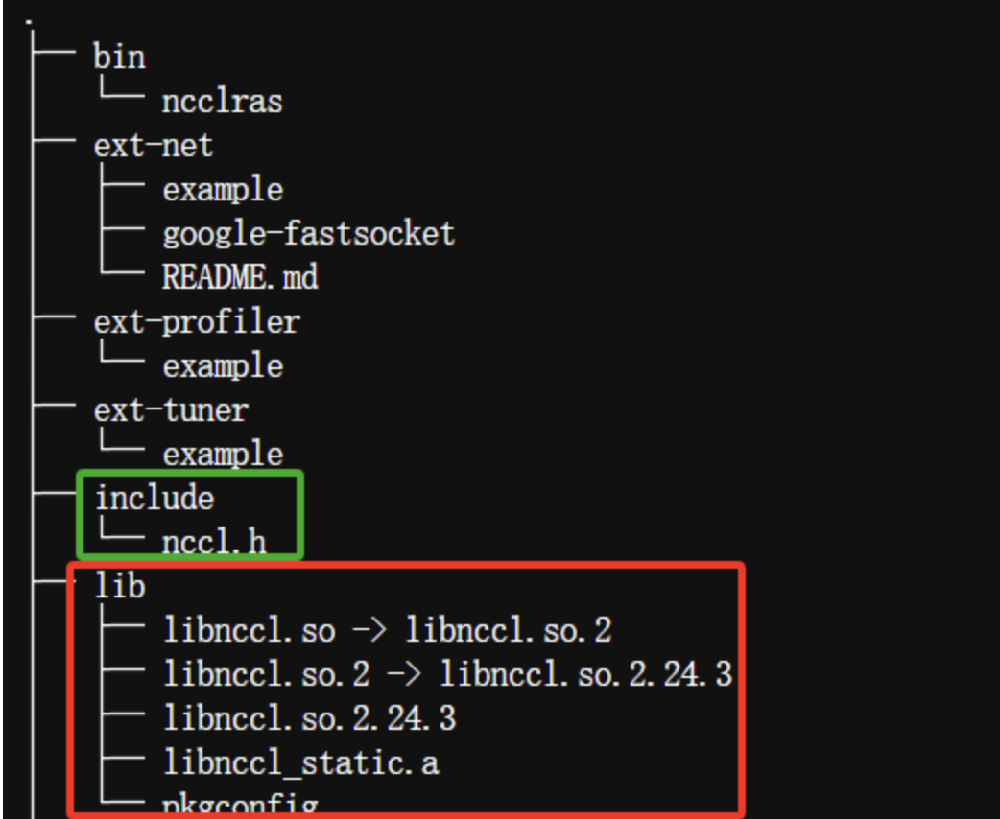
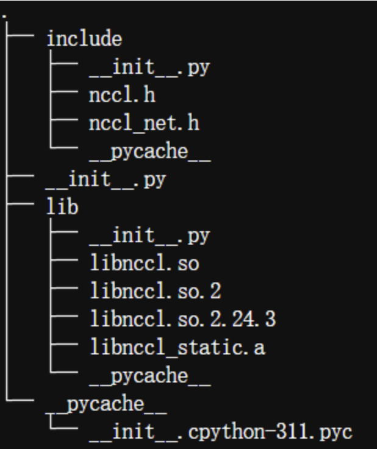

# 训练

## Prompt 修改
请修改 [examples/format_prompt/math_format.jinja](examples/format_prompt/math_format.jinja) 文件

### 解释
解释下该文件内容：

```
{{ content | trim }} A conversation between User and Assistant. The user asks a question, and the Assistant solves it. The assistant first thinks about the reasoning process in the mind and then provides the user with the answer. The reasoning process and answer are enclosed within <think> </think> and <answer> </answer> tags, respectively, i.e., <think> reasoning process here </think><answer> answer here </answer>
```

python代码是这样处理该jinja的：

```python
from jinja2 import Template

with open(format_prompt, encoding="utf-8") as f:
    self.format_prompt = f.read()

prompt_str: str = example[self.prompt_key]
format_prompt = Template(self.format_prompt.strip())
prompt_str = format_prompt.render(content=prompt_str)
```

其中`prompt_str`是用户输入的prompt，`format_prompt`是`math_format.jinja`文件的内容。
prompt_str = format_prompt.render(content=prompt_str) 这行代码将`jinja`中的`{{ content | trim }}`替换为`prompt_str`。所以`format_prompt.render`函数中会有`content=prompt_str`这个变量赋值，`trim`函数是去除`prompt_str`两端的空白字符(类似于strip())。


# 踩坑记录

## (NCCL问题) RuntimeError: NCCL error: invalid usage
查看log发现有一条`NCCL version 2.21.5+cuda11.0`，而我的cuda版本是12.4，所以需要提升NCCL版本。

**完整操作可参考：** [https://blog.csdn.net/kabuto_hui/article/details/145949489](https://blog.csdn.net/kabuto_hui/article/details/145949489)

解决方案：重新编译cuda12.4下的NCCL
```bash
git clone https://github.com/NVIDIA/nccl.git
cd nccl
make -j12 src.build BUILDDIR=path-to-nccl CUDA_HOME=/usr/local/cuda NVCC_GENCODE="-gencode=arch=compute_86,code=sm_86"
```

参数解释：

- j12: 表示使用12个核心，使用nproc查看总核心数，根据具体情况进行调整；
- BUILDDIR: 表示编译后，一些文件的存储路径；默认是nccl/build；当然如果是root用户可以指定到/usr/local/ncc/；
- CUDA_HOME: 表示CUDA的目录，默认就是/usr/local/cuda；
- NVCC_GENCODE：如果不添加该字段，默认会编译支持所有架构；为了加速编译以及降低二进制文件大小，添加该字段，具体comute_35,sm_35是应该是和显卡算力相匹配，如A100是compute_80,sm_80。RTX3090是compute_86,sm_86。


完成编译后，编译产物出现在nccl/path-to-nccl/lib中：


将编译产物拷贝到当前的虚拟环境中：虚拟环境地址`/lib/python3.11/site-packages/nvidia/nccl`替换原来的头文件（上图绿色框内的头文件）和动态库（上图红色框里的.so和.a文件）：


**成功后的运行信息**：`NCCL version 2.26.2+cuda12.4`